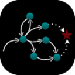

# Planner: PRP -- (P)lanner for (R)elevant (P)olicies



* Version: 0.4
* [Wiki](https://github.com/QuMuLab/planner-for-relevant-policies/wiki)

## Build
```
cd src/
./build_all
```

## Citing
```
./src/prp --citation
```

## Usage
```
./src/prp <domain> <problem> OPTIONS

Options:
--jic-limit TIME_LIMIT
    Only perform JIC for the given time.

--forgetpolicy 1/0
    Throw out the policy after every simulation.

--replan-on-failure 1/0 (default=1)
    Replan if the state isn't recognized.

--fullstate 1/0
    Use full states in the regression.

--planlocal 1/0
    Plan locally to recover before planning for the goal.

--partial-planlocal 1/0
    Use the partial state that matches the expect state when planning locally.

--limit-planlocal 1/0
    Limit the planlocal searching to a fixed number of search steps.

--plan-with-policy 1/0
    Stop searching when the policy matches the current state.

--depth NUM_ACTIONS (default=1000)
    Stop simulations and consider it a failure after NUM_ACTIONS actions.

--trials NUM_TRIALS (default=1)
    Number of trials to run for the simulator.

--detect-deadends 1/0
    Use primitive deadend detection to ensure a strongly cyclic solution.

--generalize-deadends 1/0
    Generalize the deadends found based on relaxed reachability.

--online-deadends 1/0
    Generate and store deadend states that are found online.

--optimized-scd 1/0
    Perform optimized strong cyclic detection when checking the partial policy.

--final-fsap-free-round 1/0 (default=0)
    Do one final JIC round with the best policy found (closing every leaf possible).

--optimize-final-policy 1/0 (default=0)
    Do a final simulation and throw out any pair (or FSAP) not used.

--dump-policy 1/2
    Dump the policy to the file policy.out. 1 creates a switch graph, while 2 creates a human readable form.

--debug-output 1/0
    Output plans and other information during the planning process.
```
